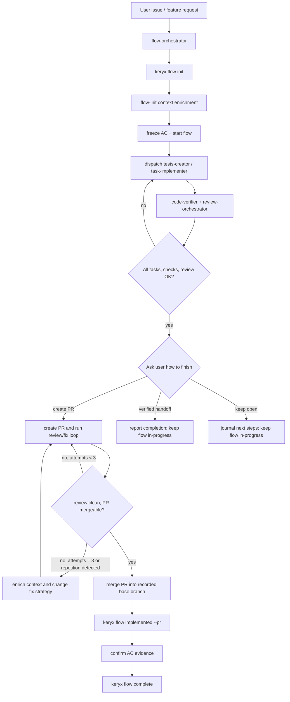

# Flow Orchestrator

## Purpose

Flow Orchestrator is the Task Manager-aware implementation orchestrator.
It wraps the existing gdskills pipeline with `keryx flow` state.

Use this skill instead of `job-orchestrator` when the user wants a managed
story/issue lifecycle with frozen acceptance criteria, task state, an explicit
completion choice, Code Health, and a durable flow package in
`.metaproject/flows/`.

Do not modify `job-orchestrator` or `task-implementer` behavior. They remain
usable without Task Manager. This skill coordinates them through flow state.

## Hard Preconditions

1. Read `.metaproject/index.md` and `.metaproject/metaproject.json`.
2. Confirm Task Manager is enabled:
   - `.metaproject/metaproject.json` must contain `modules.tasks.enabled: true`;
   - `.metaproject/skills/flow/SKILL.md` should exist.
3. If Task Manager is not enabled, stop and tell the user to run:

```bash
keryx update
```

or initialize with the Task Manager module enabled. Do not emulate flow state by
hand.

## Source Of Truth

Flow state lives in `.metaproject/flows/<flow-id>/`.

CLI-owned files:

- `flow.json` - never edit by hand (read it freely; write only via the CLI).
- status transitions - only through `keryx flow ...`.
- task status - only through `keryx flow task done ...`.
- task attempt counts - only through `keryx flow task attempt ...`.
- frozen acceptance criteria changes - only through
  `keryx flow ac update <id> --reason "<why>"`.

Agent-editable files:

- `description.md`
- `context.md`
- `plan.md`
- `tasks.md` for task definitions only
- `journal.md`

## Lifecycle



## Phase 0: Route And Resume

### 0.0 State Resumption Check

The input contract accepts `mode: "resume"`; this is the procedure behind it.
Run it before asking the user anything, on **every** invocation — not only when
`mode` is `resume`. A session that restarts mid-flow remembers nothing of what
it already tried. The flow package does.

1. Run `keryx flow list`. Any flow whose status is `in-progress`,
   `implemented`, `completing`, or `blocked` is an interrupted flow.
2. If one exists, ASK the user, with the concrete numbers, once:
   "Found an in-flight flow `<id>` '<title>' (status `<status>`, tasks
   `<done>/<total>`). Resume it, or start a new flow?" Never guess.
3. If resume:
   1. Run `keryx flow status <id>` and read the flow package —
      `description.md`, `plan.md`, `context.md`, `journal.md`, and the frozen
      `acceptance-criteria.md`.
   2. Read `.metaproject/flows/<dir>/flow.json` (read-only; it stays CLI-owned)
      and take `tasks[].attempts.count` and `tasks[].attempts.log` for every
      task that is not `done`. **That is the attempt count. Never count
      attempts from your own context** — a resumed session's context starts at
      zero while the real count does not, and a loop bound computed from zero
      is not a bound.
   3. Ask the record which task is next, rather than deriving it:

      ```bash
      keryx flow next <id> --json
      ```

      This is the first task whose `status` is not `done` and whose declared
      `dependsOn` are all `done` — the ordering computed from the package
      instead of re-derived by you from prose.

   4. **Read the `resume` field before dispatching anything.** It has three
      answers and they are not interchangeable:

      - `never-started` — nothing has been tried. Dispatch normally.
      - `ended` — a previous attempt reported how it finished. This is a retry;
        the budget in step 6 applies.
      - `unresolved` — an attempt was opened and **no end was ever recorded**.
        Whether its work already landed is UNKNOWN. Do NOT treat this as
        `never-started`. Inspect the working tree and the task's
        `evidenceRefs` first, decide whether the work is there, and only then
        either close the stale attempt
        (`keryx flow task attempt <id> <Tn> --outcome failed --detail "<what you found>"`)
        or close the task (`keryx flow task done <id> <Tn>`). Re-dispatching
        over an unresolved attempt is how the same work gets done twice.

      `keryx flow next` also lists every OTHER not-done task carrying an
      unresolved attempt, under `unresolved`. Those are parallel dispatches that
      never reported back; resolve them the same way before assuming the flow is
      idle.

   5. Before dispatching a worker for that task, record the attempt:

      ```bash
      keryx flow task attempt <id> <Tn> --outcome started --detail "resumed after session restart"
      ```

   6. Apply the Phase 4 attempt budget against the **persisted** count. If
      `attempts.count` for the task has already reached **three**, do not
      re-dispatch the same approach: go to the re-planning step (Phase 4, PR
      review/fix loop, step 4) and record the decision in `journal.md`.
   7. Run the repetition check before spending an attempt, whatever the count
      says:

      ```bash
      keryx review loop --flow <id> --task <Tn>
      ```

      A non-zero exit means the same finding has recurred or two consecutive
      rounds produced identical output. Go straight to the re-planning step.
      Do not spend the remaining attempts on the same approach because the
      budget has some left — that is the failure this check exists to catch.
   8. If the flow is `blocked`, read the blocking reason from `journal.md`,
      resolve or escalate it, then `keryx flow unblock <id>`.
4. If the user wants a new flow, continue at 0.1.

Record attempts as they happen, not only on resume:

```bash
keryx flow task attempt <id> <Tn> --outcome started|failed|blocked [--detail "<what happened>"]
```

`attempts.count` is append-only and lives in `flow.json`. A counter that lives
only in the orchestrator's context resets to zero exactly when the loop bound
matters most, which makes it not a counter.

### 0.1 Route

1. Reuse the `keryx flow list` output from 0.0.
2. If an active flow obviously matches the user request, use it.
3. If multiple active flows could match, ask one concise question.
4. If no flow exists and the request is multi-step, create one:

```bash
keryx flow init --issue <url>
```

or:

```bash
keryx flow init --title "<short formalized problem>"
```

5. Run `keryx flow status <id>` and read the flow package.
6. Record the git base branch from which the flow branch was created in
   `context.md` and `journal.md`; the PR must later be merged into this exact
   branch.

## Phase 1: Initialize The Flow Package

Use `.metaproject/skills/flow/init.md` as the local flow-init procedure.

Required context sources:

- gdgraph for impacted files and dependency relationships;
- gdctx for compact command/search/diff output;
- gdwiki for architecture, domain rules, business behavior and decisions;
- memory for lessons learned, repeated failures and historical constraints;
- health/testing reports for baseline risk.

Required rules:

- `.metaproject/rules/core/requirements-management.mdc`
- `.metaproject/rules/core/implementation-plans.mdc`
- `.metaproject/rules/core/subagent-context-construction.md`
- `.metaproject/rules/core/subagent-status-protocol.md`
- `.metaproject/rules/core/tdd-workflow.mdc`
- `.metaproject/rules/core/code-style-patterns.mdc`
- `.metaproject/rules/core/error-handling.mdc`
- `.metaproject/rules/core/implementation-doc-mandate.mdc`
- `.metaproject/rules/core/execution-metrics.md`

Execution metrics (opt-in): when a USER runs this orchestrator directly, at the
start ask "Collect execution statistics for this run? (yes/no)" per
`rules/core/execution-metrics.md`. If yes, append the `## Execution Metrics`
section at the end and save it under the flow dir (`<flow-dir>/metrics/`). Never
ask or emit it when dispatched as a subagent.

Write or update:

- `description.md` - problem, expected outcome, out of scope;
- `context.md` - compact links and findings, not raw dumps;
- `plan.md` - chosen approach and trade-offs;
- `tasks.md` - task definitions grouped by context, test, implement, review, docs;
- `acceptance-criteria.md` - verifiable `ACn` criteria.

### A verification step in the plan is a task, not a sentence

Every check the plan says must happen before the work is accepted - run the
thing end to end, confirm two components agree, exercise the path no test
covers - is added with `keryx flow task add` and closed with
`keryx flow task done`. Prose in `plan.md` blocks nothing, and an
orchestrator that wrote the step is the same one deciding whether to run it.

The failure this prevents is specific and has happened: a plan listed
"confirm both components agree on the same input" as step 5, the
implementation shipped without it, and review found that the two did not
agree at all - the change could not work in production. The check had been
identified correctly and then skipped, because nothing made skipping it
visible.

Tasks are the mechanism for this. `keryx flow complete` runs a `tasks` gate
over them, so an unrun verification step keeps the flow open instead of being
quietly dropped.

Know the gate's exact scope, because for years this file claimed a gate that
did not exist and 24 completed flows shipped with an open task:

- the gate is **opt-in per flow package**, keyed on `gates.tasks` in
  `flow.json`, which `keryx flow init` writes for every flow it creates. A
  package created before the gate landed does not carry the flag, and for it
  the gate reports `skipped` and blocks nothing;
- a task fails the gate when its status is not `done`; when its disposition is
  `failed`; when its disposition is `blocked` (terminal, but the work did not
  happen — and the harness emits this disposition on its own for a run that
  ended blocked); when its disposition is `skipped` with no recorded reason; or
  when its disposition is a value this build does not recognise. An
  unrecognised disposition FAILS rather than falling through: a gate whose
  default for the unknown case is "pass" is not a gate;
- to close a task as deliberately not needed, record why:

  ```bash
  keryx flow task done <id> <Tn> --disposition skipped --reason "<why it was not needed>"
  ```

Read the `tasks` line in the `flow complete` output. If it says `skipped`, the
gate did not run and the task list is yours to verify by hand.

Then freeze and start:

```bash
keryx flow freeze <id>
keryx flow start <id>
```

## Phase 2: Execute Tasks

Use existing gdskills as workers. Do not duplicate their internal workflows.

Recommended worker routing:

| Flow task kind | Worker skill |
|---|---|
| `context` | `context-collector` |
| `test` | `tests-creator` or `test-gen` |
| `implement` | `task-implementer` |
| `review` | `review-orchestrator` |
| `docs` | `job-documenter`, `prd-creator`, or documentation-specific project skill |

### Worker communication is schema-governed

Workers do not inherit session state; every dispatch is constructed explicitly
(`.metaproject/rules/core/subagent-context-construction.md`). Each dispatch is a
`subagent-dispatch` object
(`.metaproject/core/gdskills/contracts/subagent-dispatch.schema.json`) and each
worker reply is a `subagent-result` object
(`.metaproject/core/gdskills/contracts/subagent-result.schema.json`) whose first
line is `STATUS: <status>`
(`.metaproject/rules/core/subagent-status-protocol.md`).

Dispatch payload, bound to the flow (map `target_skill` from the routing table):

```json
{
  "contract_version": "1.0.0",
  "run_id": "<flow-id>",
  "dispatch_id": "<flow-id>-<Tn>",
  "orchestrator": "flow-orchestrator",
  "target_skill": "task-implementer",
  "task": { "title": "<Tn title>", "description": "<what to do>", "intent": "implement" },
  "acceptance_criteria": ["<the frozen ACn lines this task must satisfy>"],
  "context_refs": [
    { "path": ".metaproject/flows/<dir>/context.md", "kind": "context", "exists": true },
    { "path": ".metaproject/flows/<dir>/plan.md", "kind": "plan", "exists": true },
    { "path": ".metaproject/flows/<dir>/acceptance-criteria.md", "kind": "custom", "exists": true }
  ],
  "files_to_read": ["<only files gdgraph/gdctx narrowed to>"],
  "constraints": [
    "Never edit flow.json.",
    "Never edit frozen acceptance criteria.",
    "Return a subagent-result; first line must be STATUS:."
  ],
  "allowed_actions": ["read", "write", "run-command", "git"],
  "output_contract": { "schema": "subagent-result", "artifact_path": ".metaproject/flows/<dir>/journal.md" },
  "budget": { "max_output_tokens": null },
  "provenance": { "created_at": "<iso-utc>", "created_by": "flow-orchestrator" }
}
```

After a worker succeeds, the flow-orchestrator marks task progress:

```bash
keryx flow task done <id> <Tn>
```

If new work is discovered:

```bash
keryx flow task add <id> --title "<task>" --kind <kind>
```

### Interpreting worker results (STATUS protocol)

Read the worker's `STATUS:` line first; never infer the outcome from prose. A
reply with no `STATUS:` line is treated as `NEEDS_CONTEXT` — re-request one
properly formatted `subagent-result`.

| Worker `status` | flow-orchestrator action |
|---|---|
| `DONE` | Accept. `keryx flow task done <id> <Tn>`. Continue. |
| `DONE_WITH_CONCERNS` | Accept, record every concern in `journal.md`, decide continue vs. add a fix task, then `flow task done`. Never silently drop concerns. |
| `NEEDS_CONTEXT` | Do not fail. Enrich `context_refs`/`files_to_read` from gdgraph/gdctx/wiki/memory, then re-dispatch the same `dispatch_id`. |
| `BLOCKED` | `keryx flow block <id> --reason "<worker reason>"`; resolve or escalate one concise question, then `flow unblock` and re-dispatch. |
| `FAILED` | Emitted by harness **child** workers (`src/harness/child/contract.ts`), never by skill workers — `task-implementer` maps its own `failed` onto `BLOCKED`. Retry once with the same dispatch. If it fails again, block the flow and surface the error to the user. |

Carry `run_id`/`dispatch_id` across retries so the flow journal stays traceable,
and record every dispatch against the task's persisted counter so a session
restart does not reset the budget:

```bash
keryx flow task attempt <id> <Tn> --outcome started --detail "<dispatch_id>"
# on a BLOCKED or unusable reply, before re-dispatching:
keryx flow task attempt <id> <Tn> --outcome blocked --detail "<worker reason>"
```

## Phase 3: Verification And Review

Before accepting implementation:

1. Run focused tests for touched scope.
2. Run `code-verifier`.
3. Run `keryx health run` when Code Health is enabled.
4. Check the bounds, then run `review-orchestrator` with relevant domains.

   ```bash
   keryx review budget --spent <usd-so-far> --outstanding <subagents you already have in flight>
   ```

   A non-zero exit means the spend ceiling (3 USD by default) has been reached:
   **stop and ask the user** rather than dispatching another fan-out.

   `--outstanding` is the part that matters here. `review-orchestrator`
   dispatches reviewers in parallel and runs *nested* under this skill, and
   keryx cannot observe subagents in another process. Passing the count you
   already have in flight is the only thing that makes the concurrency cap mean
   anything across the nesting; omit it and the cap bounds the reviewer fan-out
   alone, which the review record then states plainly rather than implying
   otherwise.

5. If findings require code changes, dispatch fix work through `task-implementer`
   and record the fix task in the flow.
6. Close the skill-learning loop (see `rules/core/skill-lifecycle.mdc`). Collect
   the `skill_drift` fields from task-implementer results and the
   `## Skill Learning` block from review-orchestrator. For each flagged
   project-skill, dispatch a subagent — on a cheaper / non-flagship model if one
   is available (`keryx review tier --findings 1 --diff-lines 0` resolves one from runtime
   provider detection; see `rules/core/model-selection.mdc`), otherwise the session model — to run
   `keryx skills learn --from-review <report> --skill <m>/<s>` and return the
   proposal. Then read the proposal and `skills learn apply` it, or discard it.
   Never apply unread; never put `learn` in a hook.

The implementer never self-accepts. Only flow-orchestrator decides whether the
flow can move to `implemented`. Record any applied skill updates in the
completion report.

## Phase 4: Completion Choice

When tasks, verification and review are complete:

1. Stop before creating a PR or changing the flow to `implemented`.
2. Ask the user how to finish. Do not infer that every flow needs a PR:

```text
How should this flow end?

  A) Create a PR, review it, merge it into the flow's base branch, and complete the managed flow
  B) Finish with a verified handoff and no PR
  C) Keep the flow open for more work

> pick a letter (no default; wait for the user)
```

3. Follow the selected outcome:

- **A - Create PR and merge:** create or confirm a PR in the author's name.
  Preserve the base branch recorded during initialization. Do not mark the
  flow implemented or complete before the PR is merged into that branch.

### A dispatched run answers the question from its input

The choice above is the USER's, and a subagent has no user to ask. When this
skill is dispatched by another skill the answer arrives in the input, and asking
anyway is how a dispatched run stalls forever on a prompt nobody will read.

Read it from the **typed fields**, and validate them first:

```bash
keryx skills contracts validate <dispatch.json> --schema flow-orchestrator-input
```

`base_branch`, `completion_outcome` and `operator_confirmed` are properties of
that contract, not constraint strings. The distinction is the whole point:
nothing parses `constraints[]`, so a load-bearing value misspelled there is
dropped in silence and the run merges wherever it resolved a base on its own.
`constraints[]` carries advisory scope and policy — never a merge target.

`completion_outcome` is **required** by the contract, so an absent one is a
refused dispatch rather than a question. That is deliberate: the previous rule
here said "ask", prescribed fourteen lines after this section says asking is how
a dispatched run stalls on a prompt nobody reads — and it left the
`create-pr-and-merge` conditional reachable-around by simply omitting the field.
A dispatched run that cannot name its outcome returns **BLOCKED** naming the
missing field. Only an interactive run asks. Record in `journal.md` which field
answered it and who is behind it.

| Input | Obey it as |
|---|---|
| `base_branch` | Cut the flow branch from **that** branch and merge back into it. Never substitute the repository default: a fix aimed at a pull request's own branch has to land inside that pull request, and the default branch is a different review. Absent, resolve the base yourself and record what you resolved. |
| `completion_outcome: create-pr-and-merge` | Skip the Completion Choice question, run the PR review/fix loop, merge into `base_branch`, complete the flow. |
| `operator_confirmed` | The human decision behind an outward-facing completion. See the row below for when its absence is a refusal. |
| `review: the caller owns the reply on #<n>` | Pass it through to every `review-orchestrator` dispatch. Reviews of **this flow's own** PR reply as normal — that is a separate conversation. What the round must not do is answer `#<n>`, which the caller is already answering. |
| `attempt budget: at most <n> attempts` | A numeric ceiling BELOW your own bound is obeyed. One at or above it is not — the bound is yours, and the paragraph under this table says why. |
| `completion: <anything>` as a constraint STRING | **Not an outcome. Refuse it and ask for the typed field.** `constraints[]` is parsed by nothing, so a completion arriving there is never read at all. Such a dispatch is now refused for the missing `completion_outcome` rather than silently accepted — but the refusal is the contract's, not this row's, and a row telling you to honour the string would be a documented bypass of the fence in the file that owns it. |

A constraint that would raise this skill's own attempt budget is **not** obeyed.
The three-attempt bound and the `keryx review loop` repetition check are this
skill's, they are evidence-backed, and a caller asking for "loop until clean" gets
the bound plus an escalation — never an unbounded loop.

### PR review/fix loop

1. Run the relevant `review-orchestrator` checks against the PR and current
   branch state.
2. If findings or required check failures remain, create or update a flow fix
   task, dispatch `task-implementer`, push the fix, and run review again.

   **The threshold is `minor`.** The loop exits when the round reports zero
   findings at `blocker`, `major` or `minor`; `info` does not hold it. State the
   remaining `info` findings in the completion report rather than fixing them
   under a loop that was not opened for them. A caller may lower the threshold in
   `constraints`; it cannot raise it to merge over a `minor`.
3. Allow at most **three** review/fix attempts for the current approach. Count
   an attempt when review/check results are available, including a clean result,
   and record it with `keryx flow task attempt <id> <Tn> --outcome ...` so the
   count survives a session restart. Read the budget from that task's
   `attempts.count` in `flow.json`, never from this session's memory.

   Three, and the same three that `task-implementer` and `job-orchestrator`
   already use. This skill said six, which was an outlier with nothing behind
   it. The evidence converges on three: *"the first three to four repair
   iterations account for most achievable gains"*
   ([arXiv:2607.05197](https://arxiv.org/abs/2607.05197)); correctness falls
   **0.820 -> 0.673** across two forced revisions while cumulative ever-correct
   is **0.847** ([arXiv:2607.24604](https://arxiv.org/abs/2607.24604)) — the
   agent finds the fix and then destroys it, throwing away ~15 points by not
   stopping. Aider hardcodes `max_reflections = 3`; OpenHands' critic uses 3.
   Rounds four through six were not buying convergence; they were buying
   regressions.

4. **Before** spending an attempt, and regardless of how much budget is left,
   run the repetition check:

   ```bash
   keryx review loop --flow <id> --task <Tn>
   ```

   It escalates (non-zero exit) when the same finding recurs in two rounds, or
   two consecutive rounds produce identical review output. It reads the review
   packages on disk and the persisted `attempts.count`, not this session's
   memory, and it deliberately never reads the remaining budget — an agent
   emitting the identical failing output three times must be caught on the
   second, not after the budget runs out.

5. If the third attempt is not clean, **or the repetition check escalated
   earlier**, do not blindly repeat the same loop. Enrich context from the
   findings, affected graph, relevant wiki, and health/testing artifacts;
   identify the likely cycle cause; choose a materially different fix strategy
   or split the work into narrower tasks; record the decision in `journal.md`;
   then continue with the enriched context.
6. Never merge while findings or required checks remain unresolved. If the
   re-planned approach still cannot produce a mergeable PR, leave the flow
   `in-progress` and report the blocker instead of forcing completion.

When the PR is mergeable and required checks are green, merge it into the
recorded base branch (the branch from which the flow branch was created),
verify that the merge completed, and only then record it through the CLI:

```bash
keryx flow implemented <id> --pr <pr-url>
```

- **B - Verified handoff without PR:** do not create a PR and do not run
  `keryx flow implemented` or `keryx flow complete`. Produce the completion
  report with verification and acceptance-criteria evidence, record that the
  implementation work is finished, and leave the Task Manager flow
  `in-progress`. Explain that the current CLI requires a recorded PR before it
  can transition the flow to `done`.
- **C - Keep open:** record remaining or deferred work in `journal.md`, report
  the current verification state, and leave the flow `in-progress` for resume.

Only continue to Phase 5 after the user selects A, the review/fix loop is
clean, and the merge into the recorded base branch is confirmed.

## Phase 5: Complete The Flow

Use `.metaproject/skills/flow/complete.md`.

For every acceptance criterion, verify evidence and confirm:

```bash
keryx flow ac confirm <id> ACn --note "<evidence>"
```

Then run:

```bash
keryx flow complete <id>
```

Completion is allowed only after the PR merge has been confirmed. The merge
target must be the base branch captured when the flow was created; do not
silently retarget or close against another branch.

If gates fail, the CLI returns the flow to `in-progress`. Add a journal note,
create fix tasks, and repeat Phase 2.

## Completion Report

Finish with:

- flow id and final status;
- selected completion outcome;
- PR URL when a PR was created;
- tasks completed;
- acceptance criteria evidence summary;
- verification/review results;
- unresolved risks or blocked gates.

For a verified handoff without PR, distinguish "implementation work finished"
from Task Manager status `done`: report the flow as `in-progress` and explain
why it was intentionally not transitioned.

## Contracts

flow-orchestrator communicates through explicit schemas, not free prose:

| Direction | Schema |
|---|---|
| Skill input | `skills/gdskills/orchestration/flow-orchestrator/input-contract.schema.json` |
| Skill output | `skills/gdskills/orchestration/flow-orchestrator/output-contract.schema.json` |
| Worker dispatch | `core/gdskills/contracts/subagent-dispatch.schema.json` |
| Worker result | `core/gdskills/contracts/subagent-result.schema.json` |
| Durable flow state | `.metaproject/flows/<id>/flow.json` (CLI-owned; never agent-written) |

Validate a concrete worker message before trusting it:

```bash
keryx skills contracts validate <file> --schema subagent-dispatch
keryx skills contracts validate <file> --schema subagent-result
```

## Boundaries

- Do not replace `job-orchestrator`. This is the Task Manager variant.
- Do not bypass the flow CLI for state changes.
- Do not let `task-implementer` edit `flow.json`, frozen AC, or decide
  completion.
- Do not read broad source trees when gdgraph/gdctx/wiki/memory can first
  narrow context.
